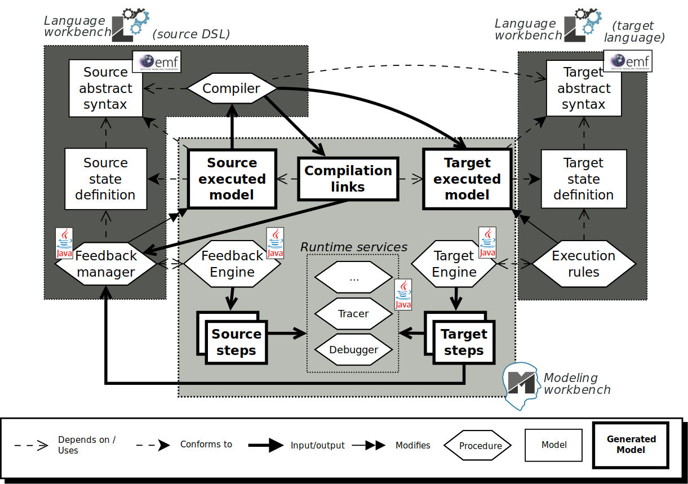

# GEMOC Studio extension for compiled DSLs

This repository contains a set of eclipse plugins to extend the [GEMOC Studio](http://gemoc.org/studio.html) with a new metaprogramming approach to define executable DSLs: the **compilation** to another executable language.

An example is also provided in the folder [`examples/ad2petri`](examples/ad2petri), with a small activity diagrams DSL that compiles to Petri nets.

## Installation

For now, no update site is provided for this extension. To install it, load the plugins (in the [`plugins`](plugins) folder) in the workspace of the latest GEMOC Studio, and start a new eclipse application from there.

## Usage

Summary of the architecture:

### Language definition

Given a chosen target executable language, also implemented using the GEMOC Language Workbench, a compiled DSL is composed of:

- An **abstract syntax**, defined using Ecore, in a dedicated plugin and with code generated using a `genmodel` file.
- A **compiler**, which is a model transformation from the abstract syntax to the abstract syntax of the target language. It can be written with any language, as long as a Java class implementing the `org.gemoc.execution.feedbackengine.Compiler` interface is provided. In addition, this `Compiler` must be exposed using the `org.gemoc.execution.feedbackengine.compiler` extension point.
- A **definition of the state** of conforming executable models, by defining aspects using the K3 language. These aspects must only contain dynamic data fields, and do not require operations.
- A **feedback manager**, which is a Java (or Java-compatible, eg. Xtend) class implementing the `FeedbackManager` interface. It is responsible for translating target states and steps into source steps and states.
- A **feedback configuration**, which is a Java (or Java-compatible, eg. Xtend) class implementing the `FeedbackConfiguration` interface. It provides all the information required for feedback management: the feedback manager, the target language name and engine, the target configuration, This `FeedbackConfiguration` must be exposed using the `org.gemoc.execution.feedbackengine.feedback` extension point.
- A **language definition**, written using [Melange](http://melange.inria.fr/), which assemble all parts of the language. Specifically for compiled DSLs, two annotations (using the Melange `annotation` keyword) must be used: `compiler` and `compiler`, each pointing to the IDs of the extensions mentioned above.

Screenshot of an opened GEMOC Studio Language Workbench while implementing the [`ad2petri`](examples/ad2petri) example:

### Model execution and debugging

Screenshot of an opened GEMOC Studio Modeling Workbench while debugging a model from the [`ad2petri`](examples/ad2petri) example:

